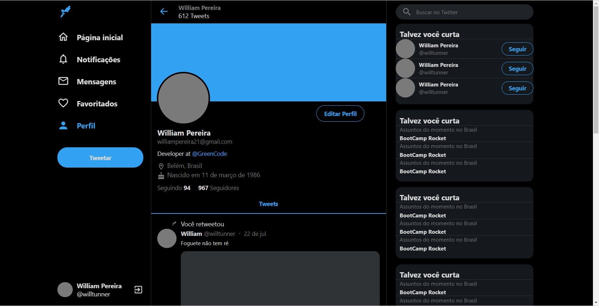
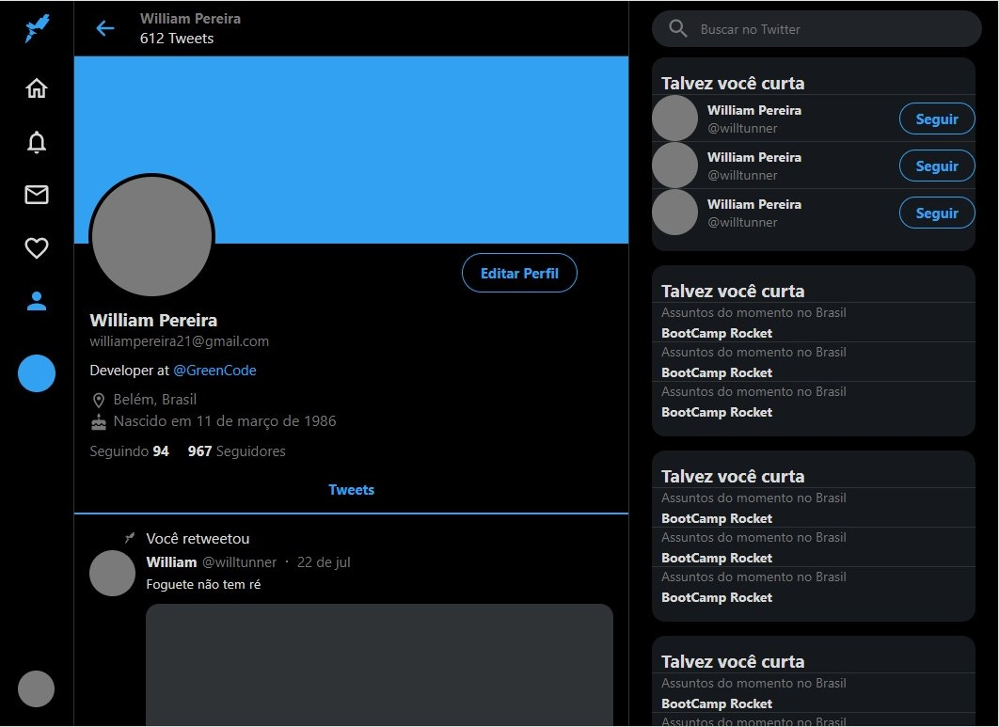
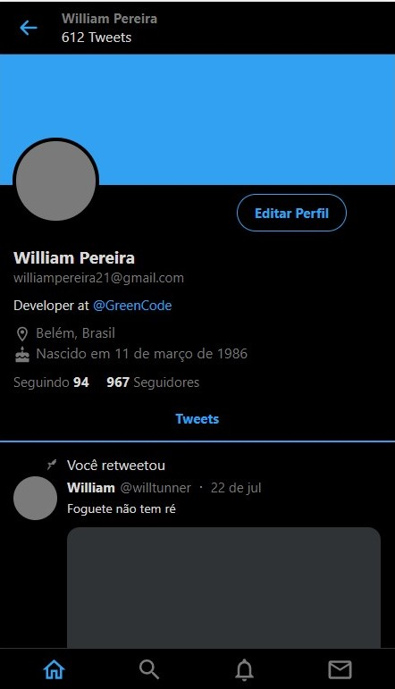

# Clone Twitter
> Projeto criado em base de estudo de uma aula da Rocketseat, link abaixo. 
> https://www.youtube.com/watch?v=K-8z_4xvT3o&t=555s

#### O site foi feito em ReactJs e Css basicamente e ele é ajustavel conforme a resolução da plataforma que esteja usando seja web/Desktop, Tablet ou Mobile.

## Imagens do projeto
### Tamanho web

### Tamanho Tablet

### Tamanho Mobile

## Como usar:
1. Abra o projeto 
2. Use: "npm install" para baixar os node_modules
3. Depois use: "npm start" 
4. Vai abrir em: http://localhost:3000/

## Conteudo desse estudo
* Html
* Css
* Typescript
* React sticky box
* Styled Components
* Styled Icons

